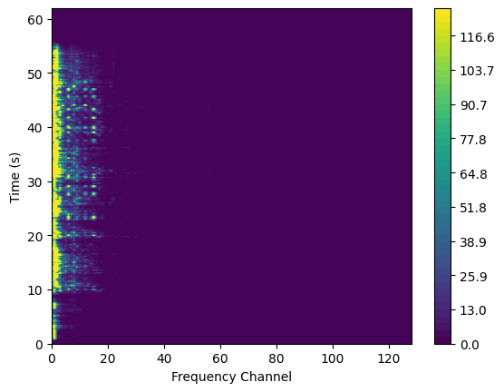

Create a Pipeline
=================

In this tutorial, we will create a simple
pipeline and execute it. Later on, we'll create
our own version of a block and use it
in the pipeline. All of the code can be found
in one block at the bottom of this page.

With Bifrost, there is one main module you will
be calling as a user: ``bifrost.pipeline``. This
handles all the behind-the-scenes pipeline construction,
giving you a high-level view at arranging a series of
blocks.

We would like to construct a pipeline to perform the following:

1. Read in a ``.wav`` audio file to a ring buffer.
#. Channelize it with a GPU FFT.
#. Write it back to disk as a filterbank file.

Blocks in this Example
----------------------

This setup will require bifrost blocks which:

1. Read in the ``.wav`` file.
#. Copy the raw data to the GPU.
#. Split the time axis into chunks which we can FFT over.
#. FFT this new axis.
#. Take the modulus squared of these FFTs.
#. Transpose this data into a format compatible with the sigproc writer.
#. Copy the data back to the CPU.
#. Convert the data into integer data types.
#. Write this data to a filterbank file.

This file could then be used to do things like calculating
the beats per minute (bpm) of the song at different points of time, or
could be used to just view the frequency components of the song with time.

First, ensure you have a working Bifrost installation. You should
also have some CUDA-compatible GPUs to run this example.

Code Walkthrough
----------------

Now, let's create the pipeline.

The first thing to do is to actually load in Bifrost. Load in the base
library as ``bf``:

.. code:: python

    import bifrost as bf

Next, let's load in some function libraries. We want ``blocks``,
which is the block module in Bifrost, which is a collection of
previously-written blocks for various functionality,and
``views``, which is a library for manipulations of ring headers. 
We'll also import the ``Pipeline`` class from bifrost to
improve readability:

.. code:: python

    import bifrost.blocks as blocks
    import bifrost.views as views
    from bifrost import Pipeline

Before we start working with the data we want to initialize an
instance of the pipeline class with the default parameters:

.. code:: python

    pipeline = Pipeline()
    pipeline.as_default()

Now, let's create our data "source," our source block. This is the
block that feeds our pipeline with data. In this example,
we work with a ``.wav`` file. I assume that you have own some
sort of audio file and can convert it, using, e.g.,
`online-convert <http://audio.online-convert.com/convert-to-wav>`_.

Now, I want to load this into Bifrost. The syntax for
this instance is:

.. code:: python

    raw_data = blocks.read_wav(['heyjude.wav'], gulp_nframe=4096)

Where ``['heyjude.wav']`` is a list of ``.wav`` files, which is in this
case, a sample of `Hey Jude`. ``gulp_nframe`` is an argument passed
to this block which tells it how many `frames` of data to `gulp` at once.

Some terminology:

- `frame`: One chunk of data. In this case, it is a single sample of the
  audio file. By setting ``gulp_nframe=4096``, we tell the block to read
  in 4096 samples at a time, and put these into the ring buffer at once.
- `gulp`: One read or write of the ring buffer. Imagine the block
  taking a gulp of data. Then ``gulp_nframe`` is how many frames are
  in that gulp.

Now, ``raw_data`` is now a reference to a ``block`` object, which implicitly
points at the `ring buffer` which will hold the raw ``.wav`` data.

Next, we want to put this data onto the GPU. Bifrost makes this simple.
Insert a copy block as follows:

.. code:: python

    gpu_raw_data = blocks.copy(raw_data, space='cuda')

In this line we are telling Bifrost to create a new block, a ``copy`` block,
and set its input to be the ``raw_data`` variable which is the source block
for our audio file. Then, by setting ``space='cuda'``, we tell Bifrost
to create a ring in GPU memory, and copy all of the contents of ``raw_data``
into this new ring. With this GPU ring, we can connect more blocks and
do GPU processing.

Now, since we only want to do a Fourier transform at different parts of the
song, not the entirety of the song, we want to chunk up this audio file
into segments over which we can Fourier transform. This lets us get a
frequency view at various points of the song. Since our data comes
as one long time stream, we want to break it up into parts. Bifrost lets
you do this without extra processing. You simply manipulate the `header`
of the ring, which stores all of the descriptions for the ring. These
manipulations are accomplished with ``views``:

.. code:: python

    chunked_data = views.split_axis(gpu_raw_data, 'time', 256, label='fine_time')

What have we done here? We took ``gpu_raw_data``, which is a block on the GPU,
and which implicitly points to its output ring buffer which sits on the GPU,
and put it into the ``split_axis`` view. We said take the ``'time'`` axis
of this ring, and break it up into ``256``-size chunks. Create a new
axis for this data, and call that axis ``'fine_time'``.

Note that `views` are special in that they do not actually modify the data.
They just modify the metadata, which lets blocks interpret the data
differently.

Now, let's actually do the processing. We want to do an FFT along this
256-size axis, and we want to do it on the GPU. Bifrost knows which
ring is on the GPU and CPU, so this is implicitly passed to the FFT block:

.. code:: python

    fft_output = blocks.fft(chunked_data, axes='fine_time', axis_labels='freq')

So, in this line, we create a new block, an `FFT` block, and send in
the chunked data. We tell the FFT block to perform the Fourier transform
along the ``'fine_time'`` axis, which is the one of 256-size chunks,
and then after Fourier transforming, to name the output axis ``'freq'``.

The Bifrost FFT block wraps ``cuFFT``, the CUDA FFT package, which is
heavily optimized. Inside the block, ``bifrost.ndarray``'s are being
created from the output ring of ``chunked_data``, and this is being
passed with ``ctypes`` into a C++ function.

Next, we want to take the square of these FFTs. In Bifrost,
this can be done with the ``detect`` block:

.. code:: python

    squared = blocks.detect(fft_output, mode='scalar')

This block takes in the output of the FFT (we are still on the GPU!),
squares each element (the ``'scalar'`` mode), and then puts this in a
new ring, implicitly stored in the ``squared`` block object.

Now, after carefully reading the documentation for the ``transpose`` block,
we decide that we want to arrange the axes such that it goes in as
``['time', 'pol', 'freq']``. To do this, we need to transpose it.
Bifrost has the ``transpose`` block to do this. We simply type the
desired output axis layout as the only argument, and it is all performed
on the GPU for us:

.. code:: python

    transposed = blocks.transpose(squared, ['time', 'pol', 'freq'])

This transposes the axes for us. Now we can ship it into sigproc writer.
But first, we have to offload from the GPU:

.. code:: python

     host_transposed = blocks.copy(transposed, space='cuda_host')

Then, convert to an 8-bit integer data type for storage, with the
quantize block (``'i8'`` means an ``8``-bit ``i`` nteger).

.. code:: python

    quantized = bf.blocks.quantize(host_transposed, 'i8')

Finally, we pass the data stream into a `sink` block, which ends
the pipeline and stores the data in a filterbank file:

.. code:: python

    blocks.write_sigproc(quantized)

In this case, the filename will be determined from
the header information, which contains the name of the original
``.wav`` file. The output file is of type ``.fil``, and
is the `channelized` version of the original music file. It
is the frequency decomposition of the audio.

In order to tell the pipeline when to shutdown and to run:

.. code:: python

    pipeline.shutdown_on_signals()
    pipeline.run()

So, what have we done? We:

1. Initialized the pipeline.
#. Read in the ``.wav`` file.
#. Copied the raw data to the GPU.
#. Split the time axis into chunks which we could FFT over.
#. FFT'd along this new axis.
#. Took the modulus squared of these FFTs.
#. Transposed this data into a format compatible with the sigproc writer.
#. Copied the data back to the CPU.
#. Converted the data into integer data types.
#. Wrote this data to a filterbank file.
#. Ran the pipeline

All the Code for Your Pipeline
------------

For ease of reference, here is all the code at once:

.. code:: python

    import bifrost as bf
    import bifrost.blocks as blocks
    import bifrost.views as views
    from bifrost import Pipeline

    pipeline = Pipeline()
    pipeline.as_default()
    raw_data = blocks.read_wav(['heyjude.wav'], gulp_nframe=4096)
    gpu_raw_data = blocks.copy(raw_data, space='cuda')
    chunked_data = views.split_axis(gpu_raw_data, 'time', 256, label='fine_time')
    fft_output = blocks.fft(chunked_data, axes='fine_time', axis_labels='freq')
    squared = blocks.detect(fft_output, mode='scalar')
    transposed = blocks.transpose(squared, ['time', 'pol', 'freq'])
    host_transposed = blocks.copy(transposed, space='cuda_host')
    quantized = bf.blocks.quantize(host_transposed, 'i8')
    blocks.write_sigproc(quantized)

    pipeline.shutdown_on_signals()
    pipeline.run()

Reading Back a Filterbank File
------------

In order to see what we have done, we can also read back the
file we just wrote. For this we will only need ``blocks``:

.. code:: python

    import bifrost.blocks as blocks

To visualize the results, we will import ``numpy`` 
and ``matplotlib.pyplot``:

.. code:: python
    
    import numpy as np 
    import matplotlib.pyplot as plt

First, we will create a source block that will return the data from
the filterbank file:

.. code:: python

    myfile = 'heyjude.wav.fil'
    sigprocsource = blocks.read_sigproc(myfile, gulp_nframe=4096)

Now we will create a file reader to read the file and use it to read
in all of the frames present in the file in order to get the data 
and some header information from the filterbank file:

.. code:: python 

    filereader = sigprocsource.create_reader(myfile)
    data = filereader.read(filereader.nframe())
    duration = filereader.duration()

Making a Spectrograph/Waterfall Plot of the Results
------------

If we know the sample rate of the wav file we could set the x-axis
to correspond to frequencies, but for now we will just leave these
as channel numbers. For, the y-axis, however, we now know the duration
so we can label this axis in seconds. We store these values as numpy
arrays:

.. code:: python

    freqaxis = np.arange(len(data[0,0,:])
    timeaxis = np.linspace(0,duration,len(date[:,0,0]))

We now can prepare for plotting by making all of our data the same
shape with meshgrid and plotting the first channel with matplotlib:

.. code:: python
    
    X,Y = np.meshgrid(freqaxis, timeaxis)
    Z = data[:,0,:] # plot only one channel/polarization
    fig = plt.figure()
    lev = np.linspace(Z.min(), Z.max(), num=50)
    cont = plt.contourf(X,Y,Z, levels=lev)
    ax = plt.gca()
    ax.set_xlabel('Frequency Channels')
    ax.set_ylabel('Time (s)')
    plt.colorbar(cont)
    plt.show()
    plt.close()

If everything goes well we should see a figure similar to this one:

    
All the Code for Reading and Plotting the Results:
------------

.. code:: python

    import bifrost.blocks as blocks
    import numpy as np 
    import matplotlib.pyplot as plt
    myfile = 'heyjude.wav.fil'
    sigprocsource = blocks.read_sigproc(myfile, gulp_nframe=4096)
    filereader = sigprocsource.create_reader(myfile)
    data = filereader.read(filereader.nframe())
    duration = filereader.duration()
    freqaxis = np.arange(len(data[0,0,:])
    timeaxis = np.linspace(0,duration,len(date[:,0,0]))
    X,Y = np.meshgrid(freqaxis, timeaxis)
    Z = data[:,0,:] # plot only one channel/polarization
    fig = plt.figure()
    lev = np.linspace(Z.min(), Z.max(), num=50)
    cont = plt.contourf(X,Y,Z, levels=lev)
    ax = plt.gca()
    ax.set_xlabel('Frequency Channels')
    ax.set_ylabel('Time (s)')
    plt.colorbar(cont)
    plt.show()
    plt.close()

